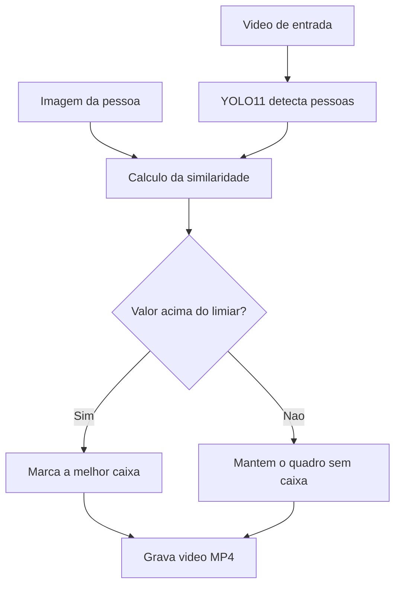

# Person Reidentification with YOLO

Projeto de Visao Computacional para reidentificar uma pessoa em videos
capturados por cameras e perspectivas diferentes. O YOLO11 detecta as pessoas
e cada recorte e comparado com uma imagem de referencia usando cor HSV,
orientacao dos gradientes e a combinacao dessas caracteristicas.

## Objetivo

Receber uma imagem contendo a pessoa de interesse e localizar essa mesma
pessoa em cada quadro de dois videos. A saida conserva o video completo e
desenha somente uma caixa vermelha sobre a pessoa mais semelhante a referencia.

> Este projeto compara a aparencia visual da roupa e dos contornos. Ele nao faz
> reconhecimento facial e nao determina a identidade civil de uma pessoa.

## Fluxo da solucao



Para cada quadro, o algoritmo executa as seguintes etapas:

1. O YOLO11n detecta somente objetos da classe `person`.
2. Cada caixa detectada e limitada ao tamanho valido da imagem.
3. O programa recorta cada pessoa encontrada.
4. Cada recorte e comparado com a imagem de referencia.
5. A pessoa com maior similaridade e selecionada.
6. Se o valor superar o limiar, a caixa e desenhada no quadro.
7. O quadro processado e gravado no video de saida.

## Metodos de similaridade

### 1. Cor HSV162

A imagem e convertida de BGR para HSV. O matiz e dividido em 18 faixas, a
saturacao em 3 e o brilho em 3, formando `18 x 3 x 3 = 162` combinacoes. Os
histogramas normalizados sao comparados pela distancia de Bhattacharyya:

```text
similaridade = 1 - distancia_de_Bhattacharyya
```

Quanto mais proximo de `1`, mais parecidas sao as distribuicoes de cores.

### 2. Orientacao dos gradientes

Os gradientes horizontal e vertical sao calculados com Sobel. Suas orientacoes
entre 0 e 180 graus formam um histograma com 18 faixas, ponderado pela magnitude
das bordas. Esse metodo compara formas, contornos e padroes da roupa.

### 3. Similaridade combinada

A combinacao utiliza os dois sinais:

```text
similaridade_combinada = 0,60 x cor + 0,40 x orientacao
```

O peso maior para cor foi usado porque as roupas dos videos possuem cores bem
distintas. Os pesos podem ser alterados em `Candidato.combinada`.

## Escolha automatica da configuracao

Para cada video sao testados os tres metodos e onze limiares, de `0,25` ate
`0,75`. Isso produz 33 configuracoes por video e 66 no total. A qualidade leva
em conta:

- cobertura: proporcao de quadros nos quais a pessoa foi aceita;
- margem: diferenca entre a melhor e a segunda melhor pessoa;
- continuidade: deslocamento da caixa entre quadros consecutivos.

As medicoes completas ficam em `entrega/resultados_testes.csv`.

## Requisitos

- Python 3.10 ou superior
- Aproximadamente 2 GB livres para instalar as dependencias
- Windows, Linux ou macOS

## Como executar no Windows

Abra o PowerShell dentro da pasta do projeto e execute um comando por vez:

```powershell
python -m venv .venv
.venv\Scripts\Activate.ps1
python -m pip install --upgrade pip
pip install -r requirements.txt
python testar_yolo_video_tracker_uma_pessoa.py
```

Se o PowerShell bloquear a ativacao do ambiente virtual, execute:

```powershell
Set-ExecutionPolicy -Scope Process -ExecutionPolicy Bypass
.venv\Scripts\Activate.ps1
```

## Como executar no Linux ou macOS

```bash
python3 -m venv .venv
source .venv/bin/activate
python -m pip install --upgrade pip
pip install -r requirements.txt
python testar_yolo_video_tracker_uma_pessoa.py
```

## Saidas

Ao terminar, os arquivos serao criados na pasta `entrega/`:

- `video1_reidentificado.mp4`
- `video2_reidentificado.mp4`
- `resultados_testes.csv`

O programa testa os metodos `cor`, `orientacao` e `combinada`, com limiares
entre 0,25 e 0,75. A configuracao final e escolhida considerando cobertura,
separacao entre candidatos e continuidade espacial.

## Exemplo de uso

Para processar os dois videos com a configuracao padrao:

```bash
python testar_yolo_video_tracker_uma_pessoa.py
```

Exemplo de mensagem apresentada ao final:

```text
video1.mp4: cor, limiar=0.25, cobertura=98.5%
video2.mp4: cor, limiar=0.25, cobertura=100.0%
```

Nos videos gerados, o rotulo possui este formato:

```text
Pessoa reidentificada | cor 0.493
```

O ultimo numero e a similaridade entre o recorte atual e a referencia.

## Opcoes de execucao

Para alterar a confianca minima do YOLO:

```bash
python testar_yolo_video_tracker_uma_pessoa.py --confianca 0.30
```

Para informar outra pasta de entrada e outra pasta de saida:

```bash
python testar_yolo_video_tracker_uma_pessoa.py --base ./dados --saida ./resultado
```

A pasta de entrada deve conter `video1.mp4`, `video2.mp4`, as duas imagens de
referencia e o arquivo `yolo11n.pt`.

## Resultado obtido

| Video | Metodo selecionado | Limiar | Cobertura |
| --- | --- | ---: | ---: |
| video1.mp4 | Cor HSV162 | 0,25 | 98,5% |
| video2.mp4 | Cor HSV162 | 0,25 | 100,0% |

Nos sete quadros iniciais do primeiro video, a pessoa de interesse ainda nao
esta visivel. Os dois videos finais foram validados quadro a quadro e codificados
em MP4/H.264, com resolucao de 1280 x 720.

## Estrutura do projeto

```text
person-reidentification/
|-- Similaridades.py
|-- testar_yolo_video_tracker_uma_pessoa.py
|-- gerar_relatorio.py
|-- requirements.txt
|-- pessoa-foco_video1.png
|-- pessoa-foco_video2.png
|-- video1.mp4
|-- video2.mp4
|-- yolo11n.pt
|-- entrega/
|   |-- Relatorio_CP4.pdf
|   |-- resultados_testes.csv
|   |-- video1_reidentificado.mp4
|   `-- video2_reidentificado.mp4
`-- tests/
    `-- test_similaridades.py
```

## Executar os testes automatizados

Com o ambiente virtual ativado:

```bash
python -m unittest discover -s tests -v
```

Os testes verificam imagens identicas, imagens diferentes, limites entre 0 e 1
e validacao de entradas invalidas.

## Principais parametros

| Parametro | Padrao | Funcao |
| --- | ---: | --- |
| `--confianca` | `0.25` | Confianca minima das deteccoes do YOLO |
| `classes=[0]` | pessoa | Impede o processamento de outras classes COCO |
| Limiar testado | `0.25` a `0.75` | Decide se a pessoa candidata sera marcada |
| Peso da cor | `60%` | Participacao do HSV na medida combinada |
| Peso da orientacao | `40%` | Participacao dos gradientes na medida combinada |

## Solucao de problemas

### `python` nao foi reconhecido

Instale o Python pelo site oficial e marque a opcao **Add Python to PATH**.
Depois feche e abra novamente o terminal.

### Erro ao ativar o ambiente no PowerShell

```powershell
Set-ExecutionPolicy -Scope Process -ExecutionPolicy Bypass
.venv\Scripts\Activate.ps1
```

### O programa nao encontra um arquivo

Execute o comando dentro da pasta do projeto e confirme se os videos, imagens
de referencia e `yolo11n.pt` estao presentes.

### Processamento lento

O programa funciona em CPU, mas pode demorar alguns minutos. Quando uma GPU
compativel com PyTorch/CUDA estiver configurada, o Ultralytics podera utiliza-la.

## Limitacoes e melhorias futuras

- Alteracoes fortes de iluminacao podem mudar o histograma HSV.
- Pessoas com roupas semelhantes podem reduzir a margem entre candidatos.
- Oclusoes e pessoas muito pequenas podem impedir a deteccao do YOLO.
- Um modelo especifico de Person Re-ID, como OSNet, poderia comparar descritores
  profundos e melhorar a robustez entre cameras muito diferentes.
- Suavizacao temporal e associacao por ID poderiam reduzir trocas em cenas mais
  longas ou lotadas.

## Autor

Guilherme Santos
